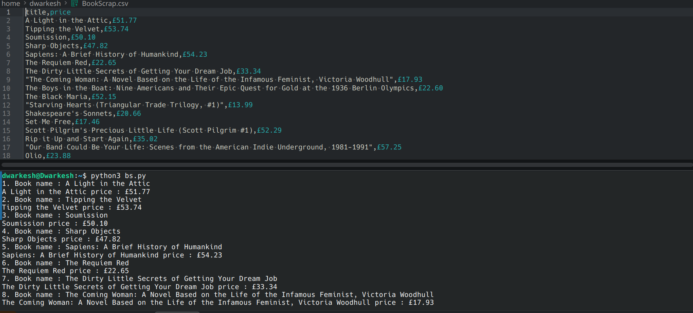
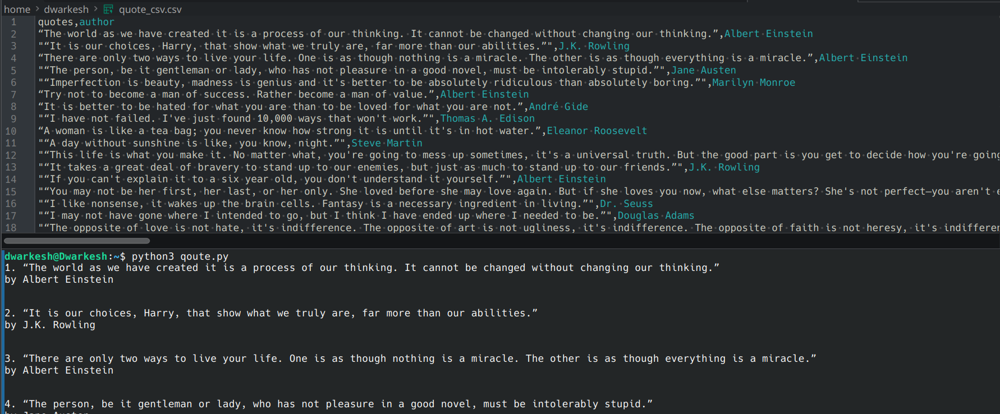
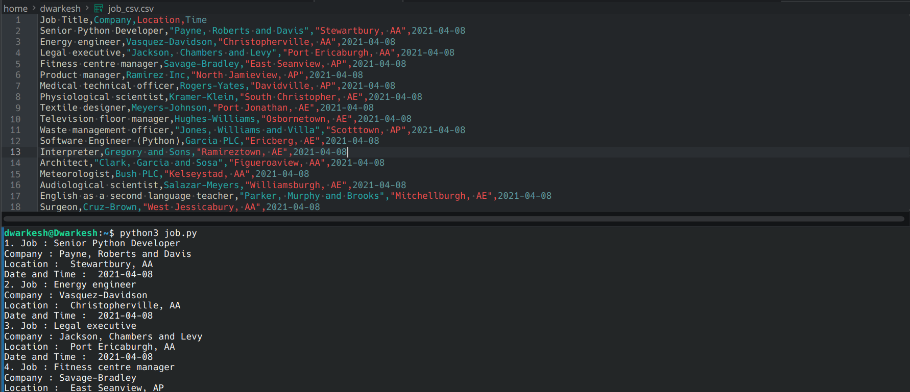
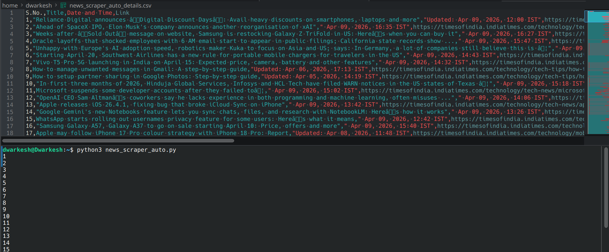

# web-scraping-projects
In this Repo I make some projects which I have mentioned below 

**How to run:**
first of all You should install BeautifulSoup4
run these command in your terminal
1. pip install requests beautifulsoup4
2. python3 Project_Name.py

**My Projects:**
1. bs.py : This script scrapes all Books at every page from "books.toscrape.com"  

2. qoute.py : This script scrapes all Quotes at every page from "quotes.toscrape.com"

4. job.py : This script scrapes all job details like Job Title, Company Name, Location, Date from "https://realpython.github.io/fake-jobs/"

5. news_scraper_auto.py : This script scrapes (News Title, Date and Time, News Link) entire page of the Technology section of "The Times of India"  

These scripts add the scrape details to the .csv file after scraping.
